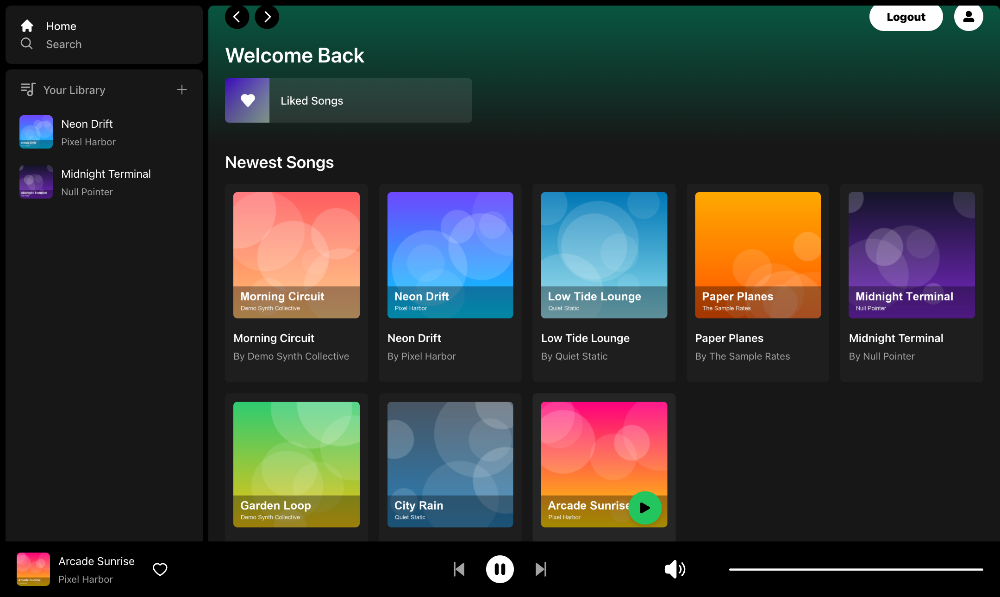
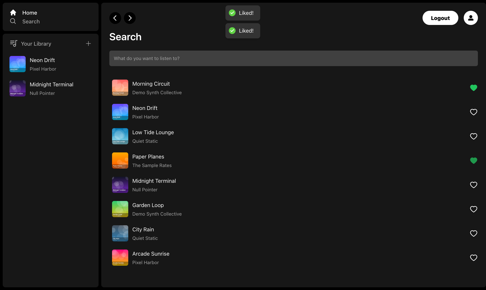
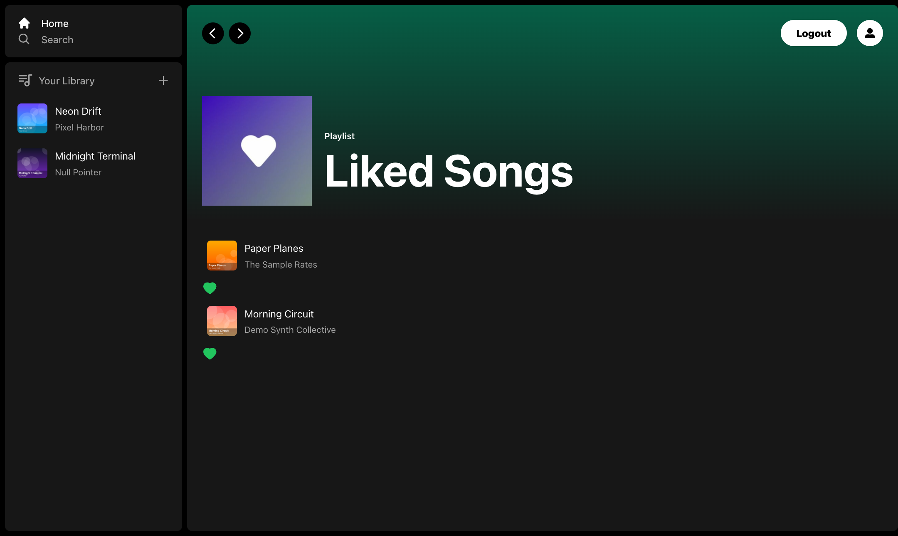

# Spotify Clone — Next.js + Supabase Music Player

[](https://s-harshni.github.io/Spotify-Clone/)


<!-- live-links -->
> 🔗 **Live demo:** [s-harshni.github.io/Spotify-Clone](https://s-harshni.github.io/Spotify-Clone/)  
> 👤 **Portfolio:** [s-harshni.github.io/S-Harshni](https://s-harshni.github.io/S-Harshni/)  
<!-- live-links -->

A Spotify-style music streaming app: browse and search songs, play them with a persistent bottom player (play/pause, next/previous, volume), like songs, and upload your own tracks to your library. Built with the Next.js App Router, Supabase (auth, Postgres, storage) and Zustand.



## Features

- **Authentication:** email/password and OAuth sign-in via Supabase Auth UI
- **Library:** upload songs (MP3 + cover image) to Supabase Storage; your uploads appear in the sidebar
- **Player:** global player bar (`use-sound`/Howler) with play/pause, previous/next through the current list, volume and mute
- **Liked songs:** like/unlike from anywhere; a dedicated Liked Songs playlist page
- **Search:** filter songs by title (debounced, shareable `?title=` URLs)
- **Responsive UI:** Tailwind CSS, Radix UI dialogs and sliders, toast notifications

| Search | Liked songs |
|---|---|
|  |  |

## Live demo mode

The live demo runs as a static site on GitHub Pages with **no Supabase project**. With `NEXT_PUBLIC_DEMO_MODE=true`, [`libs/demo.ts`](spotify-clone/libs/demo.ts) provides an in-browser stand-in for the Supabase client:
- a signed-in demo user
- 8 bundled tracks (original, synthesized audio and generated cover art)
- likes saved in `localStorage`

Uploading is disabled in the demo. Without demo mode, the app uses Supabase exactly as before.

## Run locally with Supabase

1. Create a Supabase project and run [`spotify-clone/supabase/schema.sql`](spotify-clone/supabase/schema.sql) in the SQL editor. It creates the `users`, `songs` and `liked_songs` tables with row-level security, plus the `songs` and `images` storage buckets.
2. Configure and start:

```bash
cd spotify-clone
cp .env.example .env.local      # add your project URL and anon key
npm install
npm run dev                      # http://localhost:3000
```

Or run the demo locally without Supabase:

```bash
NEXT_PUBLIC_DEMO_MODE=true npm run dev
```

## Tech stack

| Area | Technologies |
|---|---|
| Framework | Next.js 14 (App Router, server components), React 18, TypeScript |
| Backend | Supabase: Auth, Postgres with RLS, Storage (`@supabase/auth-helpers-nextjs`) |
| State | Zustand stores (player, auth modal, upload modal), React context for the user |
| UI | Tailwind CSS, Radix UI (Dialog, Slider), react-icons, react-hot-toast |
| Forms & audio | react-hook-form, use-sound (Howler.js) |

## Project structure

```
spotify-clone/
  app/(site)/        home: newest songs
  app/search/        search page (client-side title filter)
  app/liked/         liked songs playlist
  actions/           server data loaders (songs, by title, by user, liked)
  components/        Player, PlayerContent, Sidebar, Library, SongItem, LikeButton, modals, …
  hooks/             usePlayer, useOnPlay, useUser, useLoadSongUrl, useLoadImage, …
  providers/         Supabase session, user details, modals, toasts
  libs/              demo client, server Supabase helper, base-path helper
  supabase/          database schema
```

## Fixes in this version

- **Play/pause buttons did nothing** (`onClick={() => {}}`). They're now wired to the player.
- **Clicking a song on the Search and Liked pages did nothing.** It now plays.
- **Liked state never showed:** the like button queried a non-existent `Liked_songs` table.
- **`next build` failed** on lint errors, so the app could not be deployed.
- **Page refresh loop:** the auth modal refreshed the page on every mount while signed in.
- Search links were wiped on load (`?title=` reset to empty).
- Removed stray files from an accidental root-level `npm install`, and added a schema, `.env.example`, the demo mode and a Pages deployment.

## Credits

Built following Code With Antonio's Next.js 13 Spotify-clone tutorial. Demo music and artwork are generated for this project.

## Author

**S Harshni** · [Portfolio](https://s-harshni.github.io/S-Harshni/) · [LinkedIn](https://www.linkedin.com/in/ks-harshni/) · [GitHub](https://github.com/S-Harshni)
